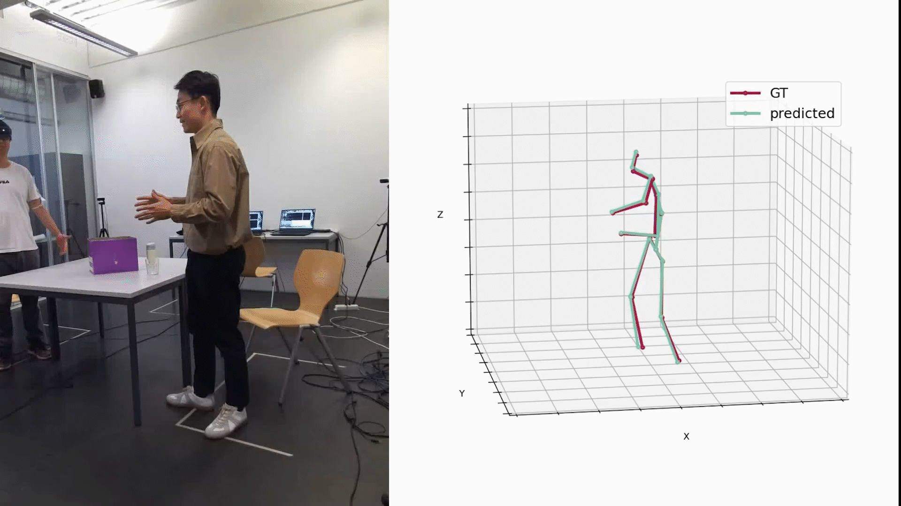

# 3D Human Pose Estimation from Multiple Dynamic Views via Single-view Pretraining with Procrustes Alignment



## About
   MDVPose is a simple yet effective framework for 3D human pose estimation from multiple dynamic views with unknown camera calibration. Unlike existing methods, it fully exploits available 3D training data and efficiently aligns multiple views using Procruste alignment and multi-view consistency. MDVPose finetunes a single-view pretrained motion encoder for multi-view scenarios, achieving state-of-the-art results on challenging datasets like Ski-Pose PTZ (22.1mm P-MPJPE) and EgoBody (-18.2mm P-MPJPE), and robust performance on Human3.6M.

   This project is finetuned based on the pretrained model from [MotionBERT](https://github.com/Walter0807/MotionBERT/tree/main). The pretrained model can be obtained from the model zoo in the MotionBERT project.
## Installation

```bash
conda create -n mdvpose python=3.7
conda activate mdvpose
# Please install PyTorch according to your CUDA version.
conda install pytorch torchvision torchaudio pytorch-cuda=11.6 -c pytorch -c nvidia
pip install -r requirements.txt
```
## Prepare the dataset
Please refer to [dataset.md](docs/dataset.md)

## Pretrain
```
python train.py --config configs/pretrain/MB_pretrain.yaml -c checkpoint/pretrain/MB_pretrain
```
The model can also be obtained from the model zoo in the [MotionBERT](https://github.com/Walter0807/MotionBERT/tree/main) project.
## Finetune 
**single-view finetuning**
```
python train.py --config configs/pose3d/MB_ft_h36m.yaml --pretrained checkpoint/pretrain/MB_release --checkpoint checkpoint/pose3d/FT_MB_release_MB_ft_h36m
```
The model can also be obtained from the model zoo in the [MotionBERT](https://github.com/Walter0807/MotionBERT/tree/main) project.
After unified pretraining and single-view finetuning, multi-view finetuning can be performed using different datasets.
## skipose
**data preprocessing**
```
python tools/preprocess_skipose.py -r path/to/skipose/dataset
```
The processed data will be saved in `data/motion3d/MB3D_f243s81`.

**multi-view finetuning**
```
python train_mv_finetune.py --config configs/multi_view/MB_ft_mv_skipose.yaml --pretrained checkpoint/pose3d/FT_MB_release_MB_ft_h36m --checkpoint checkpoint/multi_view/skipose
```
**evaluate**
```
python train_mv_finetune.py --config configs/multi_view/MB_ft_mv_skipose.yaml --evaluate checkpoint/multi_view/skipose/best_epoch.bin
```
## human 3.6M
**data preprocessing**
```
python tools/preprocess_h36m.py
```
The processed data will be saved in `data/motion3d/MB3D_f243s81`.

**multi-view finetuning**
```
python train_mv_finetune.py --config configs/multi_view/MB_ft_mv_h36m.yaml --pretrained checkpoint/pose3d/FT_MB_release_MB_ft_h36m --checkpoint checkpoint/multi_view/h36m
```
**evaluate**
```
python train.py --config configs/multi_view/MB_ft_mv_h36m.yaml --evaluate checkpoint/multi_view/h36m/best_epoch.bin
```

## infer
You can use the trained model to obtain 3D poses from other videos or images.

Please use [AlphaPose](https://github.com/MVIG-SJTU/AlphaPose#quick-start) to extract the 2D keypoints for your video first. We use the *Fast Pose* model trained on *Halpe* dataset ([Link](https://github.com/MVIG-SJTU/AlphaPose/blob/master/docs/MODEL_ZOO.md#halpe-dataset-26-keypoints)). [Here](https://github.com/Walter0807/MotionBERT/files/11526727/sample.zip) we provide an example json file.

Note: Currently we only support single person. If your video contains multiple person, you may need to use the [Pose Tracking Module for AlphaPose](https://github.com/MVIG-SJTU/AlphaPose/tree/master/trackers) and set `--focus` to specify the target person id.
Run the following command to infer from the extracted 2D poses:
```bash
python infer_wild.py --vid_path path/to/your/video --json_path path/to/alphapose-results.json --out_path path/to/your/output/file
```

## TODO
▢ Preprocessing code for egobody dataset

## Citation

If you find this repository useful for your research, please cite the following paper as such:

```
@inproceedings{gu20243d,
  title={3D Human Pose Estimation from Multiple Dynamic Views via Single-view Pretraining with Procrustes Alignment},
  author={Gu, Renshu and Zhu, Jiajun and Si, Yixuan and Gao, Fei and Xu, Jiamin and Xu, Gang},
  booktitle={ACM Multimedia 2024}
}
```